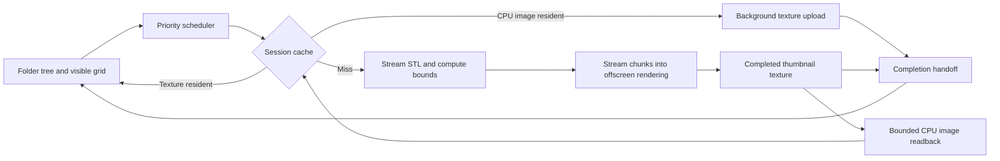

# STL Inspector design plan

Planning baseline: 2026-09-13. This document records the requested design before application implementation.

**1. Confirmed product decisions**

- C++ desktop application using Dear ImGui and Vulkan; Windows first, with portable core code.
- Use `E:/ProgrammingProjects/vulkan-guide-2` as the Vulkan/rendering reference.
- Folder tree on the left; a thumbnail grid occupies most of the remaining window.
- Selecting a folder shows its direct STL children. A toggle includes descendants.
- Generate thumbnails asynchronously, prioritizing visible files, then nearby files. Offer an explicit whole-tree prebuild operation.
- Thumbnails exist only for the current session. No persistent thumbnail cache.
- Handle gigabyte-scale STL files on local disks, removable drives, and network paths.
- Target application usage of 8 GB RAM and 4 GB VRAM. Do not assume the development GPU's larger capacity is available.
- First-version inspection includes visual viewing, AABB dimensions, triangle counts, and load errors.
- Neutral shaded rendering, a three-quarter thumbnail camera, Z-up, and millimeters as an explicit display assumption.
- Clicking a file opens a large interactive view with drag orbit, zoom, pan, reset, and standard views.
- If exact full-view geometry exceeds its budget, report the requirement and allow an explicit budget increase. Do not silently simplify the model.

Source STL files remain unmodified. Mesh repair, watertightness analysis, review labels, notes, slicing, and printing are outside the agreed first version.

**2. Environment investigation**

| Item | Observed state | Design consequence |
|---|---|---|
| Workspace | Initially empty; no Git metadata or applicable `AGENTS.md` found in workspace/ancestor checks | Create an independent project layout |
| Reference revision | `500d885a875c00bed1ec6d3ac6a1433563ee09c6` | Record provenance for adapted code |
| Reference structure | Chapters 0–6, shared Vulkan helpers, vendored dependencies | Adapt selected setup/helpers; build a dedicated inspector renderer |
| Reference libraries | SDL 2.28.4, ImGui 1.90.6 WIP, vk-bootstrap, VMA, GLM, fmt | A local dependency baseline is available without fetching a full engine |
| Reference license | Root MIT license; dependencies carry their own notices | Preserve applicable notices when copying code |
| CMake | 4.3.0-rc2 | Use modern project configuration and validate legacy dependency policy compatibility |
| Compiler | Visual Studio Community 2026; MSVC 19.51.36256, x64 toolset 14.51.36231 | Primary Debug/Release build uses VS 18 2026 |
| Other tools | Ninja 1.13 development build; Clang 21.1.8; Git | Ninja/Clang can be secondary build options |
| Windows SDK | 10.0.22621.0 and 10.0.26100.0 installed | Native Windows integration is available |
| Vulkan SDK | `C:/VulkanSDK/1.4.341.1`, glslc and glslangValidator available | Compile shaders through CMake dependencies |
| Vulkan runtime | Loader 1.4.341; validation layer available | Vulkan 1.3 baseline is supported locally |
| GPU | NVIDIA GeForce RTX 4070 Ti SUPER, driver 616.56, API 1.4.351 | Suitable development device; still enforce the requested 4 GB target |
| Queue topology | Family 0: 16 graphics/compute/transfer queues with presentation support | Request foreground and background graphics queues from this family |
| Additional queues | Separate transfer and compute families exist | Optional future transfer optimization; unnecessary for initial design |
| Features | Timeline semaphores, dynamic rendering, synchronization2 supported | Use explicit asynchronous submission/completion tracking |
| CPU | AMD Ryzen 9 5950X, 16-core model | Start with a bounded worker pool, not one worker per logical CPU |
| Existing build cache | Reference cache targets Visual Studio 17 2022 | Do not reuse its generated build directory |

Investigation used file reads, Git status/revision, compiler/tool version probes, registry CPU identification, and `vulkaninfo`. Machine RAM and free disk capacity were not established: sandbox CIM queries denied access and drive counters were unavailable. The requested application budgets drive this design regardless. No STL fixtures were found in the reference assets. A representative user collection has not been inspected, so file counts, storage latency, and thumbnail throughput remain unmeasured. No application build or runtime test has been performed at this planning stage.

The reference's `chapter-6/vk_engine.cpp` contains useful initialization, dynamic rendering, swapchain, and ImGui integration patterns. Its `uploadMesh()` uses `immediate_submit()`, which submits to the foreground graphics queue and waits on a fence. That path cannot serve the inspector's thumbnail pipeline. Its singleton engine, glTF scene/material system, 48-byte vertices plus indices, broad image barriers, and fixed ImGui pool/image-count assumptions also require replacement or adaptation.

**3. User experience**

The top bar contains Open Folder, the current root/path, Refresh, filename filter, sort selection, recursive toggle, thumbnail-size control, and background-work controls. Accept a folder through a Windows folder picker, a typed path, command-line argument, or drag and drop. The Windows path adapter supports Unicode, long paths, and UNC shares.

The resizable left pane expands folders lazily. Enumeration runs off the UI thread; expanding or selecting a directory shows a loading state immediately. Access failures appear on the affected node. Symbolic links and junctions are not followed recursively by default, preventing cycles and accidental traversal outside the chosen tree. A future opt-in would require file-identity cycle detection.

The right pane uses a virtualized, fixed-height grid. Each card shows the image, filename, file size, and status. Dimensions and triangle count appear once parsed; unknown metadata stays blank rather than triggering a synchronous read. Tooltips expose the full path and error details. Support filename/size/date sorting immediately; metadata sorts use an explicit unknown group until results arrive. Sorting and recursive-list assembly run on immutable worker snapshots, with batched publication to the UI.

Only visible grid rows and a small overscan are emitted through ImGui. Flatten expanded tree rows and clip them too. Stable file IDs keep selection intact as directory batches and thumbnails arrive. Folder changes do not wait for the previous folder's jobs. Filtering applies to the currently selected direct/recursive scope.

Single-click opens a dedicated viewer pane occupying the grid area. Back/Escape restores the grid scroll position, filter, and selection. Left-drag orbits around the AABB center, the wheel zooms, middle/right-drag pans, and toolbar buttons provide Fit and standard views. Mouse input affects the camera only while interacting with the viewport. The UI remains usable during loading and offers cancellation. Metadata distinguishes original triangle count from any non-renderable degenerate triangles.

The viewer displays AABB extents and dimensions in source coordinates, with `Assumed units: mm`; changing the display assumption does not alter the source. No claim of printability is inferred from successful rendering.

**4. Modules and ownership**

| Module | Responsibility |
|---|---|
| `app/` | Startup, settings, SDL events, main-loop coordination, shutdown |
| `ui/` | Tree, virtualized grid, viewer controls, status/error presentation |
| `filesystem/` | Directory enumeration, stable identities, metadata, source-version checks |
| `stl/` | Binary/ASCII detection, streaming parsing, bounds, chunk production |
| `jobs/` | Priorities, bounded queues, cancellation, memory reservations |
| `render/` | Vulkan device/queues, swapchain, allocations, pipelines, timelines, retirement |
| `thumbnails/` | Thumbnail state machine, scheduling, offscreen accumulation, session caches |
| `viewer/` | Resident geometry, asynchronous loading, camera and viewport rendering |
| `platform/` | Windows picker/path/I/O/memory adapters behind portable interfaces |
| `tests/` | Parser fixtures, scheduler tests, Vulkan integration and stress harnesses |

Use C++20, CMake, SDL2, Dear ImGui, vk-bootstrap, VMA, GLM, and fmt. Keep Windows headers inside platform files. Use ordinary vertex buffers for a compact position-only triangle stream; this avoids making buffer device address or descriptor indexing mandatory. Vulkan 1.3 dynamic rendering and synchronization2, plus timeline semaphores, are the baseline. Check support and present clear startup errors.

Plan to vendor the required dependency subset from the reference into this project, record versions/revision and licenses, and make builds independent of the absolute reference path. Do not pull in fastgltf or the entire chapter graph. Use the observed ImGui Vulkan texture API consistently; any later version update requires a deliberate backend migration. The reference SDL CMake file declares an old policy range, so verify it under the installed CMake and apply a scoped compatibility adjustment in the copied dependency if needed.

**5. Concurrency model and data flow**

The main thread owns SDL, all ImGui calls, foreground queue submission/presentation, and ImGui texture descriptor registration/removal. An enumeration worker performs incremental filesystem work. A bounded CPU pool parses STL chunks and computes bounds. Begin with up to four parse workers but admit only a small number of large-file jobs at once, with lower concurrency for network sources. A background GPU service owns its queue and command pools. Workers communicate through bounded message/chunk queues; they never mutate UI containers or ImGui state.

Priority order: explicit viewer load, visible thumbnails, nearby thumbnails, then an explicitly requested prebuild. Thumbnail decoding/upload from an existing CPU cache precedes STL reparsing. Pause or sharply reduce new thumbnail work during viewer loading and active orbit if frame timing deteriorates.

Jobs carry stable file identity, observed source version, rendering settings version, and a request generation. Folder/viewer changes invalidate consumer generations immediately. Cancel queued jobs promptly; active CPU work checks cancellation between bounded reads/chunks. Submitted GPU work finishes safely, then is retired. A late valid result may enter the bounded session cache, but cannot overwrite a newer file version or viewer selection.

Use a state machine such as `Discovered -> Queued -> Bounds -> Rendering -> Ready`, with `Failed`, `Cancelled`, and `Evicted` states. Partial rendering is never published as a finished thumbnail. Error results are cached for the observed source version to avoid retry loops; Refresh/Retry or a source change permits another attempt.

**6. STL loading and large-file strategy**

Support binary and ASCII STL, case-insensitive extensions, 64-bit offsets/count arithmetic, and incremental reads. For binary STL, validate the 80-byte header, 32-bit little-endian facet count, and expected size `84 + 50 * count` using checked arithmetic. Do not classify solely by the word `solid`, which can also occur in a binary header. Prefer a structurally consistent binary interpretation; otherwise attempt strict streaming ASCII parsing and report malformed/ambiguous input clearly. Accept a valid declared binary payload with trailing bytes only with an explicit warning; truncated records are errors. These structural fields are documented by the [Library of Congress binary STL description](https://www.loc.gov/preservation/digital/formats/fdd/fdd000505.shtml).

ASCII tokenization crosses read boundaries, handles scientific notation and whitespace, uses locale-independent numeric parsing, and bounds token/record lengths. Do not load the file into one string. Non-finite coordinates, arithmetic overflow, malformed syntax, missing records, and empty/no-renderable geometry produce actionable errors. Degenerate triangles are counted and skipped for drawing with a visible warning. Recompute visual face normals from positions so incorrect stored normals do not destroy the preview. Binary color extensions are ignored for the agreed neutral style.

Thumbnail generation uses two sequential passes:

1. Stream and validate geometry, compute AABB in double precision, count triangles, and record warnings.
2. Derive the camera from the complete AABB, then stream renderable triangle chunks into bounded upload buffers and accumulate them into one color/depth target.

Use an orthographic three-quarter camera for consistent thumbnails. Transform all eight AABB corners into camera space to fit width, height, and depth with margin. Recenter and normalize render coordinates while preserving original metadata. Handle point/flat bounds with a minimum scale. Use two-sided neutral shading, ambient plus directional lighting, depth testing, and no transparency. Store/load the color and depth attachments across chunk submissions so later chunks correctly occlude earlier ones. Optional small-target MSAA can be measured after the basic pipeline works.

A compact triangle needs nine float positions, or 36 bytes, with flat normals derived during rendering. A 1 GB binary STL has approximately 20 million triangles and about 720 MB of position data, before allocator/temporary overhead. The thumbnail path does not retain that complete geometry: it keeps bounded chunks and releases them after GPU use. This supports files larger than available RAM/VRAM, subject to valid format counts, I/O time, and representable coordinates.

Two passes mean approximately twice the source read volume for a cold thumbnail. This is an accepted first-version tradeoff for bounded memory and no persistent geometry cache, especially relevant on slow shares. Cap concurrent reads per source and expose progress without promising fixed completion times. Keep a handle across passes where practical; check file size/time/identity before publication and discard results if the source changes. Metadata checks cannot provide perfect snapshot consistency for every network filesystem; report read/change failures and support retry.

**7. Vulkan scheduling and synchronization**

Request two graphics queues from the same family when available: foreground priority 1.0 and background priority around 0.25. The background queue performs uploads and thumbnail rasterization. A compute-only or transfer-only queue cannot perform this graphics pipeline. Separate queue handles permit independent submission, but actual concurrency and scheduling are implementation-dependent; priorities are hints. The [Khronos queue guide](https://docs.vulkan.org/guide/latest/queues.html) documents these constraints.

Prefer same-family queues so shared images and viewer buffers need no queue-family ownership transfer. Use explicit semaphore dependencies for cross-queue handoff. If only one graphics queue is available, route background submission through the foreground queue owner with a small per-frame admission budget. Do not let multiple threads submit/present to the same queue without serialization. Give every command-recording thread its own command pools; descriptor pools also have a single owner. See [Khronos threading guidance](https://docs.vulkan.org/guide/latest/threading.html).

Maintain separate monotonic timelines for foreground and background submissions. Each upload chunk, completed image, and geometry buffer carries a completion token. Poll counters without blocking the UI. Only expose ready images; the first foreground consumer submits the matching already-signaled timeline wait to establish the cross-queue dependency. ImGui descriptor registration occurs on the main thread after that handoff is eligible. Timeline semaphores support both host completion checks and device queue dependencies, as illustrated in the [Khronos timeline sample](https://docs.vulkan.org/samples/latest/samples/extensions/timeline_semaphore/README.html).

Use precise synchronization2 barriers for transfer writes to vertex reads, depth/color attachment reuse, and final color writes to sampled reads. Set queue-family indices explicitly to `VK_QUEUE_FAMILY_IGNORED` for same-family operations. Transition to transfer-source layout for optional CPU readback before final shader-read layout, all before handing the image to the UI. Flush/invalidate mapped memory when required. Do not copy the reference's generic broad barrier helper unchanged.

Keep only a few chunks in flight. Start with 4–16 MB triangle/upload chunks, then adapt draw batch size using GPU timestamps and foreground frame timing. A large buffer chunk may need several smaller submissions. Aim for approximately 1–2 ms background batches on the development machine; this is a tuning objective, not a hardware guarantee. Preserve attachment contents between batches and leave scheduling opportunities for UI frames. Do not submit an entire huge file as one long draw/command buffer.

Each cached texture stores its last foreground-use token as well as background completion. Destroy image/view/descriptors only after all relevant uses complete. Staging slots are reused only after their upload completion; thumbnail mesh chunks are released after their last draw; viewer buffers remain until the final viewer frame completes. Track readback ownership as well. No `vkDeviceWaitIdle`, `vkQueueWaitIdle`, or main-thread fence wait is permitted in thumbnail loading/cache eviction paths. Normal foreground frame pacing may wait for its own frame slot. Swapchain recreation and shutdown may use controlled draining.

Use actual swapchain image counts for ImGui initialization, frame resources, and recreation. Present-wait binary semaphores are tracked by swapchain image so reuse follows presentation consumption. Handle resize, minimization, out-of-date/suboptimal acquisition, and unsupported surface formats explicitly. Fatal device loss stops GPU job admission and reports a controlled error rather than continuing to recycle invalid resources.

**8. Memory budgets and session caches**

Interpret GB/MB below as decimal units. These are initial category ceilings and reservations, allocated on demand. They are tunable within an overall application limit.

| VRAM category | Initial allowance |
|---|---:|
| Resident full-view geometry | 2,300 MB |
| Thumbnail textures | 400 MB |
| Background geometry/upload allocations on device-local heaps | 300 MB |
| Viewer/thumbnail render targets and swapchain-related allocations | 250 MB |
| Other device allocations and allocator slack allowance | 250 MB |
| Driver/variation headroom | 500 MB |
| Total target | 4,000 MB |

For RAM, begin with a 6,000 MB application admission ceiling beneath the 8,000 MB process target: up to 1,000 MB CPU thumbnail images, 500 MB parse/I/O chunks, 500 MB mapped staging/readback, 1,000 MB viewer-loading transients, 500 MB directory metadata/jobs, and 2,500 MB flexible runtime/allocator reserve. These are aggregate limits across workers, not per-thread allocations. Actual steady-state usage should be much lower because full CPU meshes are unnecessary. Account for deferred GPU frees, CPU cache copies, mapped buffers, and simultaneous old/new viewer resources; they still consume memory until retired.

Central reservation tokens enforce byte-based backpressure before reading, allocating, or uploading. Use VMA allocation accounting, process-memory telemetry on Windows, and Vulkan heap budget information where supported. Reduce admission or evict caches when external GPU pressure shrinks available capacity; [VK_EXT_memory_budget](https://docs.vulkan.org/refpages/latest/refpages/source/VK_EXT_memory_budget.html) reports estimates that can change with system activity. Distinguish host-visible/device-local heaps and avoid double-counting shared physical memory on UMA hardware. Application controls cannot guarantee exact driver/OS overhead, so retain headroom and measure total process usage during acceptance tests.

Two bounded caches serve the current session: a GPU texture LRU and a CPU RGBA image LRU. A default 320 × 320 RGBA8 image occupies 409,600 bytes before allocation overhead. Pin visible textures and a small overscan. GPU eviction can fall back to a CPU image and cheap asynchronous re-upload; eviction from both tiers means a future visit regenerates the thumbnail. Retain small bounds/count metadata separately within the metadata budget. Cache keys include source identity/path, size, modification time, resolution, camera/material settings, and renderer version.

Bound directory indexes too: lazy subtree discovery and per-folder snapshots prevent eager loading of the entire tree. Recursive results can be published progressively; if the metadata ceiling is reached, report a partial result set and ask the user to narrow scope or raise the budget. Never silently present partial results as complete.

Whole-tree prebuild uses the same low-priority bounded pipeline. With session-only bounded caches, it cannot keep an arbitrarily large tree hot. Show retained versus processed counts and pause prebuild when admitting more results would merely evict earlier prebuilt images, unless the user explicitly chooses a rolling scan. Do not promise permanent acceleration after prebuild or after application restart.

**9. Full-view loading and rendering**

Reuse valid bounds/count metadata from the thumbnail job. Otherwise run the bounds/validation pass first. Estimate exact resident position storage, allocation granularity, and transient upload requirements before loading. Stream into multiple bounded GPU buffers so a single large allocation or 32-bit draw count is unnecessary. Avoid CPU vertex/index duplicates and global welding tables.

If the geometry does not fit the current viewer and overall budgets, show file size, triangle count, estimated required VRAM, current limits, and available GPU budget. Offer Cancel and an explicit budget change/retry. Explain whether increasing the geometry share can stay under the overall 4 GB target or requires increasing that target as well. Do not automatically raise limits, swap indefinitely, or substitute reduced geometry. Admission can still fail because estimates and driver capacity vary; handle allocation failure without crashing.

When switching models, release or retire the previous model before admitting a replacement if both cannot fit. Keep its completed image/loading placeholder instead of retaining two large geometries. The loader gets priority over thumbnails and uploads off the main thread. Once all required geometry is ready, render the model into a per-frame viewport target and show it through ImGui.

Use dirty rendering: rerender on camera, size, material, or model changes; otherwise reuse the image. Use per-frame targets or equivalent completion-tracked buffering to avoid writing a viewport image while an earlier frame samples it. For models too expensive to draw within one responsive frame, progressively accumulate exact chunks for a frozen camera version, show progress, and restart accumulation when the camera changes. Resident geometry still respects the chosen memory limit. Responsiveness of controls does not imply 60 FPS orbit for tens of millions of triangles.

**10. Filesystem reliability and shutdown**

Use incremental error-code-based enumeration and immutable results, never disk access from tree/grid draw calls. Filesystem adapters isolate Windows overlapped reads and cancellation from portable parser code. Limit outstanding network reads and do not create unbounded replacement threads for stalled shares. Cancellation suppresses stale results immediately; actual I/O cancellation/completion can depend on the filesystem provider. Retain buffers/handles until completion and never join an I/O worker synchronously during a folder change.

Provide Refresh and Retry first, plus asynchronous revalidation when revisiting folders or acting on files. Automatic whole-tree watching is unnecessary for this version and unreliable as a sole correctness mechanism on shares. Handle permission denial, disappearing files, removable-drive removal, sharing violations, source changes, and malformed STL as local errors.

Shutdown stops new work, cancels pending filesystem/CPU jobs, drains or terminates outstanding I/O through the adapter, and waits for submitted GPU work before destruction. Surface device-loss failures explicitly. Keep resource ownership alive through completion; no detached worker may access destroyed application state.

**11. Implementation sequence and exit criteria**

| Milestone | Deliverable | Verification before proceeding |
|---|---|---|
| 1. Build and shell | Independent CMake project, dependency notices, shaders, SDL/Vulkan/ImGui window | Debug/Release build; resize/minimize/restore; clean validation startup/shutdown |
| 2. Browser and parser | Lazy folder tree, clipped placeholder grid, binary/ASCII streaming, metadata/errors | Parser edge cases; large directory responsiveness; Unicode/UNC path handling |
| 3. Asynchronous thumbnails | Offscreen chunk rendering, background queue, timelines, ready-image handoff | Known-shape screenshots; no queue/descriptor lifetime validation errors; forced single-queue mode |
| 4. Budgets and scheduling | Reservations, priorities, cancellation, CPU/GPU LRUs, session-only cache, optional prebuild | Rapid navigation, cache pressure, bounded allocations, stale-job suppression |
| 5. Full viewer | Exact resident model load, memory-limit UI, orbit/pan/zoom/standard views, progressive heavy rendering | Oversize rejection/retry; model switch during loading; viewport input and lifetime checks |
| 6. Stress and packaging | Performance counters, diagnostics, portable Windows output, usage/build documentation | Gigabyte files, network errors, sustained browsing, packaged launch on supported machine |

Build presets should include Debug with Vulkan validation/synchronization validation and Release with lightweight timing/memory telemetry. Shader outputs belong under the build directory, are dependencies of the executable, and are packaged with deterministic asset paths. Include required SDL runtime components or choose a documented static linkage configuration. Include long-path awareness in the Windows manifest. Avoid dependence on the reference's `bin`, assets, or current working directory.

**12. Validation and performance acceptance**

- Parser: binary header beginning with `solid`, ASCII tokens split across read buffers, exponent notation, locale independence, truncated records, excessive counts/overflow, NaN/Inf, degenerate/empty geometry, huge coordinates, source modification, and cancellation. Verify AABB and triangle counts against hand-authored fixtures.
- Rendering: cube, thin plate, tall/flat shapes, disconnected parts, reversed winding, bad stored normals, and small features. Compare streamed and resident rendering of the same geometry; images should agree within rasterization/antialiasing tolerance. Verify depth continuity across chunks and camera fitting.
- Concurrency: switch folders/models repeatedly during bounds, upload, rendering, and readback; evict a texture still used by in-flight UI frames; cancel prebuild and close during work. Validation must show no synchronization or object-lifetime errors.
- Memory: synthetic 1 GB and multi-GB binary fixtures, many small files, large selected models, low artificially forced budgets, and old/new resource overlap. Verify memory plateaus under the default targets and retired resources return to baseline. Very large test fixture generation is explicit and uses a dedicated test output directory with sufficient disk space.
- Filesystem: deep and Unicode paths, inaccessible directories, disappearing files, symlink/junction cycles, removable media, and UNC disconnect/reconnect. Actual network acceptance requires an available representative share; local injected failures are supplementary.
- UI throughput: test a 100,000-entry synthetic metadata listing as an initial engineering target, with draw work proportional to visible rows. Track directory publication cost separately from disk enumeration latency.
- Performance goals: on this development machine, target 60 Hz grid interaction and foreground CPU work below roughly 8 ms at the 95th percentile while thumbnails run. These are goals to measure, not results already achieved. Report CPU/GPU frame times, background batch times, bytes read, parse/render throughput, cache hit rates, active/reserved RAM/VRAM, and cancellation latency. Large-model orbit and network completion have separate measured limits.

The key early proof is milestone 3: an exact, streamed thumbnail of a gigabyte-scale STL while the ImGui grid remains responsive and allocations stay bounded. This should be established before spending time on secondary UI polish.

All product questions raised during planning have been answered. A representative STL directory/share will improve later performance validation, but is not required to begin the planned implementation once this design stage is accepted.
